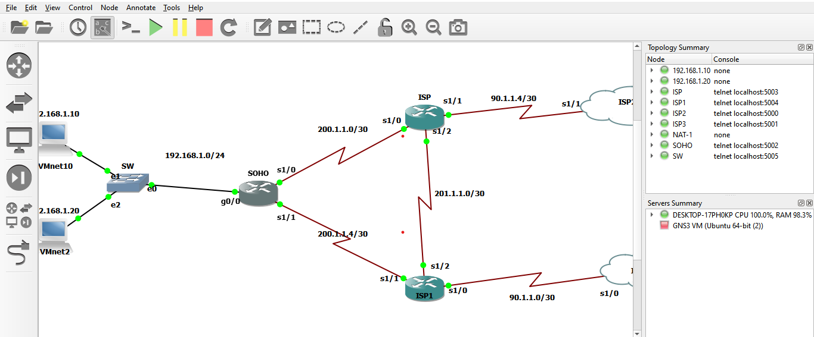

# Introduction

PyATS training program for GNS3 lab

## Requirements

* Python 3.6.9
* Vagrant (https://www.vagrantup.com/downloads.html)
* Oracle VM VirtualBox (https://www.virtualbox.org/wiki/Downloads)

## Project start

* cmd/bash + /path/to/project
* vagrant up
* vagrant ssh -- -R 5002:localhost:5002 -R 5003:localhost:5003 -R 5004:localhost:5004
* cd /vagrant/
* python3 test.py

## Topology​
​       

## Shutting down

vagrant halt